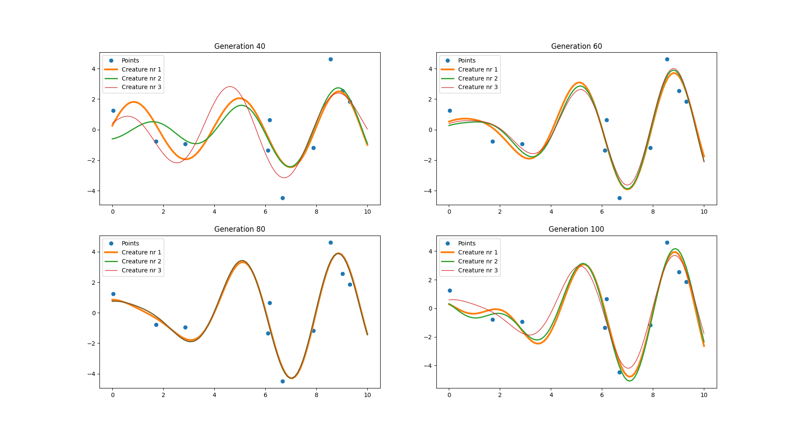

# Basic evolution algorithm

This basic elvolutionary algorithm tries to match f(x) function parameters so its result will cover all given points.

f(x) = a1 * sin(k1*x+p1) + a2 * sin(k2*x+p2) + a3 * sin(k3*x+p3) + c

main.cpp - runs simulation

display.py - shows graphs with calculated functions for parameters after 40, 60, 80 and 100 generations

Example result of display.py after creating data files with main.cpp:


Example usage of Evolution class as shown in main.cpp:
```cpp
#include <iostream>
#include "resources/Evolution.h"

int main()
{
    srand(time(0));

    // Initialize evolution class with creature population of 200 and 10 points
    Evolution evolution(200, 10);
    // Pick random points and save them
    evolution.randomize_points();
    // Fills parameters with random values
    evolution.fill_random_parameters();
    // Runs simulation for 100 generations and saves parameters of every creature
    // every 10 generations to "resources/generations/parameters_<generation number>.csv"
    evolution.run_simulation(100, 10);

    return 0;
}
```

*algorithm inspired by Jerzy Miescicki's book "Wstep do informatyki nie tylko dla informatykow"*
